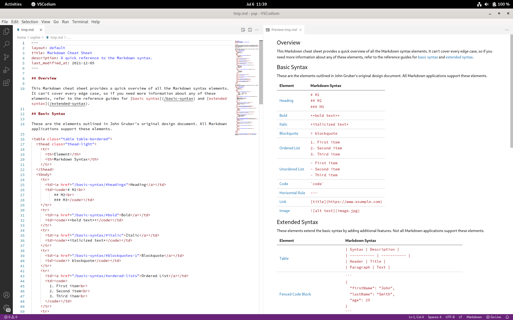
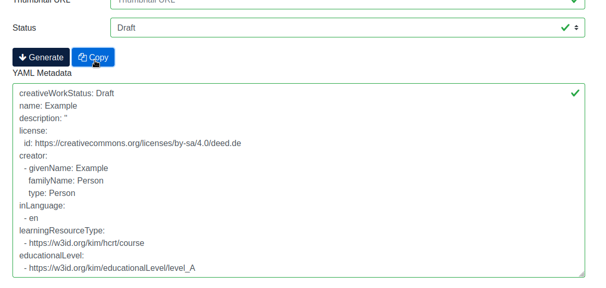

# Create and host a course/document with GitHub
This tutorial guides you through the creation of a complete, publically available course/document with GitHub.

**What's in this tutorial:**

* [Requirements](#requirements)
* [Create a repository](#create-a-repository)
* [Edit the course files](#edit-the-course-files)
* [Update the metadata](#update-the-metadata)
* [Configuration of the document generation](#configuration-of-the-document-generation)
* [Insert the course in OERSI](#insert-your-coursedocument-in-oersi)

> After completing this tutorial, you will have a fully automated course/document creation with your own material and complete metadata, hosted on GitHub for free and ready to be put into OERSI.

## Requirements
For this tutorial, you will need a GitHub account. If you don't have one yet, you have to create one. You can do this for free. It is also recommended to know Markdown, since Markdown is used to write and format your course/document files.

If you already have a GitHub account and know basic markdown syntax, you can skip this part and directly go do [Create a repository](#create-a-repository).

### Create a GitHub account

If you don't have an account yet, go to [GitHub's](https://github.com/) and sign up. Confirm your e-mail address and log in.

### Markdown

From Matt Cone's [Markdown guide](https://www.markdownguide.org/getting-started/):

>Markdown is a lightweight markup language that you can use to add formatting elements to plaintext text documents. Created by John Gruber in 2004, Markdown is now one of the world’s most popular markup languages.
>
>Using Markdown is different than using a WYSIWYG editor. In an application like Microsoft Word, you click buttons to format words and phrases, and the changes are visible immediately. Markdown isn’t like that. When you create a Markdown-formatted file, you add Markdown syntax to the text to indicate which words and phrases should look different.
>
>For example, to denote a heading, you add a number sign before it (e.g., # Heading One). Or to make a phrase bold, you add two asterisks before and after it (e.g., **this text is bold**). It may take a while to get used to seeing Markdown syntax in your text, especially if you’re accustomed to WYSIWYG applications.

If you want to learn about Markdown, what it is and what you can do with it, you can read this guide: [Get Started](https://www.markdownguide.org/getting-started/).

To see basic formatting options, check out the [Cheat Sheet](https://www.markdownguide.org/cheat-sheet/). More basic syntax can be found in the [Basic Syntax](https://www.markdownguide.org/basic-syntax/) guide.

## Create a repository
Once you are logged into GitHub, go to the [TIB Hannover markdown documents template repository](https://github.com/TIBHannover/markdown-documents-template) and click on "Use this template" -> "Create a new repository".

Assign the repository to the correct owner and give it a short but meaningful name. The name will be the URL of the repository as well. You can add a description if you want. Now make sure that the visibility of the repository is set to **Public**. This has two main reasons: firstly, so people can see your course/document, and secondly to use the GitHub pages functionality which we will get to later. Lastly, confim by clicking on "Create repository from template".

Now, a new repository is initialized for you containing the contents from the template.

### Video: Create a repository
!?[Tutorial as video](videos/create-from-template.mp4)

## Actions and Pages

<section>
The last thing you have to do now in order to generate all the course files is to go to the project's `Settings` -> `Pages` and in `Build and Development` set the source to `GitHub Actions`. After this, you can head to the `Actions` tab and click on the newest workflow run. If the worklow already ran, you will find that it failed. This happened because the Pages were not enabled yet. In this case, click on re-run jobs. Otherwise, wait until the jobs have finished. The pages and documents are now created. They can be accessed by the link that appeared under the `deploy` step.

Congratulations, you now have a complete course/document that you can make your own!

#### What are Actions?

> An `Action` is something that GitHub can execute with every commit (save) you make to the repository. This includes the generation of documents or pages, which we are using in this tutorial.
>
> A more detailed explanation of GitHub Actions can be found here: [Understanding GitHub Actions](https://docs.github.com/en/actions/learn-github-actions/understanding-github-actions).

#### What are Pages?
> A `Page` is a public website hosted by GitHub. We can use GitHub Actions to automatically generate our website and then host it on GitHub Pages for everyone to see. You can either host your site for free on `your-username.github.io` or use your own costum domain.
>
>More information on GitHub Pages can be found here: [About GitHub Pages](https://docs.github.com/en/pages/getting-started-with-github-pages/about-github-pages).

</section>

### Video: Actions and Pages
!?[Actions and Pages](videos/pages.mp4)

## Edit the course files
In the repository, you can find four `chapterXX.md` files. You can edit them or delete them and create new files. If you want to use different names for your chapters, list them with in correct order in `config.yml`. By default, the chapters are sorted alphabetically.

Text editors
============
The use of text editors that support Markdown live previews can make it a lot easier to create well-formatted Markdown files. You can install an editor locally, like Atom or Visual Studio Code.

There are also many websites that provide a live preview of your document directly in your browser.
However, there are big advantages to install an editor on your computer instead of using browser previews, though:

* you can view all your local files and easily go through your directory instead of having to copy-paste all your files, and
* you can work on your files even when you are not connected to the internet.

On top of that, in your local editor you can install plugins to further help you out. For example, if you want to use [LiaScript](https://liascript.github.io) for your course, you can install a `LiaScript-Preview` plugin and can view your course locally in your browser before having to upload it anywhere.

## Update the metadata
Perhaps the easiest way to generate your own metadata for your repository is to use the [OERSI metadata generator](https://oersi.gitlab.io/metadata-form/metadata-generator.html) and fill out at least all required fields, but in the best case fill out everything.

In your GitHub repository, paste the output of the generator into `metadata.yml`. To do this, you can copy the output to your clipboard and replace the whole file content with it by deleting the current content and then pasting from your clipboard.

### Video: Update the metadata
!?[Update the metadata](videos/5_min-github_update_metadata_with_generator.mp4)

## Configuration of the document generation
In the top level of the repository, there is a file named `config.yml`. It includes configuration for these four things:

* `output`: state the output formats that you want to be automatically generated
* `generate_landingpage`: decide whether or not to create a landing page
* `content_files`: ordering of the chapters/course files
* `generate_reuse_note`: decide whether or not to generate a reuse note on the generated documents

### Video: Configuration
!?[Config file explained](videos/39_s-github_config_file.mp4)

## Insert your course/document in OERSI
> Let's assume that...
>
> * you have put your whole completed course or document content into the repository, and it's either ordered alphabetically or you have defined the correct order in the `config.yml` file,
> * you have enabled the `Pages` for `GitHub Actions` and there are no errors during Action execution, thus you have a published Page that represents the current version of your repository,
> * you have entered full and correct metadata, ensuring the license is correct and you are not violating another work's license with this license,
> * inside your `metadata.yml` file, you have set your creative work status to `Published`,

then you are ready to put your course/document into OERSI!

For that, head to OERSI's [record updater](https://oersi.org/resources/pages/de/record_update/) and paste the URL to your GitHub Page.

## Done!
Congratulations, you did it! Now go search you course on [oersi.org](https://oersi.org)!